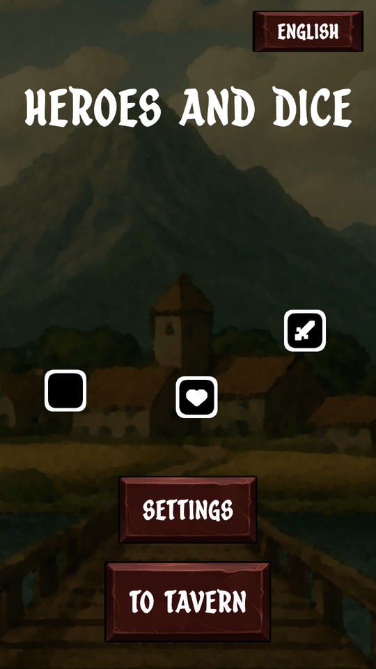
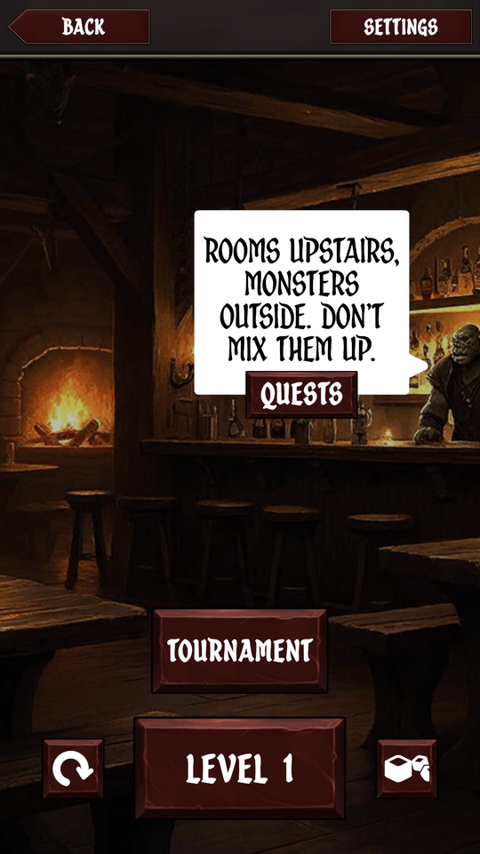
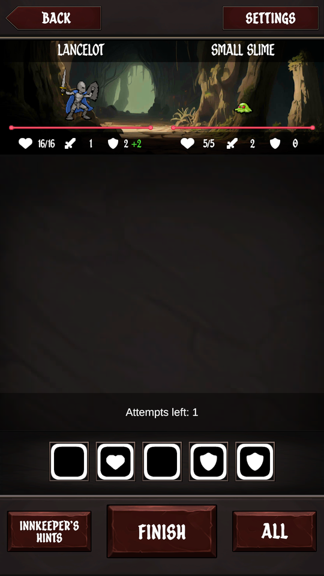
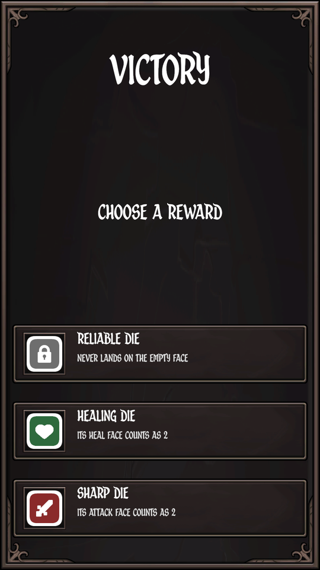

# Heroes and Dice

A small mobile dice battler made with Unity: roll five dice, keep what helps, reroll the rest, and beat ten enemies on the way to the dragon. Portrait, one hand, short sessions.

> **Work in progress.** The game is playable from start to finish, but it has not been released yet. Rules, balance, art and this document will still change.

  
  
  
  

## How it plays

A battle is a series of turns. Every die has four possible faces: **attack**, **defense**, **heal** and an **empty** one.

1. Roll all the dice. You have up to three tries per turn: tap the dice you want to reroll, or keep the roll and finish.
2. When you finish, the hero heals, gains armor for this turn and strikes the enemy. The enemy's armor is subtracted from the hit, but a hit always deals at least 1.
3. The enemy strikes back, minus the hero's armor. Then the armor from the dice wears off.
4. Five or more attack faces in one roll is a critical hit: the enemy dies at once.

The battle ends when either side runs out of health.

### Campaign

Ten enemies in a row, from the Small Slime to the Dragon. After each victory you pick one of three dice as a reward and decide in the inventory which ones go on the board. Beating the dragon starts New Game+ with tougher enemies. There are three heroes to choose from: a knight, an archer and a mage, each with its own health, damage and armor.

### Special dice

A basic die has no effect. The others change what their own roll is worth:

| Die | Effect |
| --- | --- |
| Sharp / Sturdy / Healing | Its attack / defense / heal face counts as 2 |
| Reliable | Never lands on the empty face |
| Thorny | Its defense face also deals 1 damage |
| Vampiric | Its attack face also heals 1 |
| Joker | Copies the most common face of the other dice |
| Golden | Any of its faces counts as 2 |
| Last Chance | Once per battle, survives a lethal hit with 1 HP |
| Try Die | Grants another try |
| Extra Die | Grants an extra slot on the board (up to 7 dice) |

### Tournament

A bracket of matches against a bot that plays by the same rules. Both sides use the same standard set of dice, so the inventory does not matter here. Leaving a match counts as a defeat, and a defeat ends the bracket.

## Languages

English, German, Russian, French, Portuguese, Spanish, Japanese, Chinese.

## Building

- Unity **6000.0.61f1**. Open the project and start from `Assets/_DiceBattle/Scenes/Boot.unity`.
- CI: the `Build` workflow in `.github/workflows/build.yml` builds Android or WebGL on a manual run, and Android on a `v*` tag.

## Project layout

- `Assets/_DiceBattle` — the game: scripts, scenes, prefabs, data, art, audio, fonts.
- Other folders under `Assets/` — third-party packages.
- `Docs/Agent` — notes on the architecture, the editor workflow and the backlog.

## Licence

The [MIT licence](LICENSE) in this repository covers **the source code only** (`Assets/_DiceBattle/Scripts`).

Art, music, sounds, fonts and third-party packages belong to their authors and stay under their own licences; the MIT licence does not apply to them. Licence files are kept next to the assets where the authors provide them. A full list of third-party assets with authors, sources and licences is being put together and will be added here and to the in-game credits.
